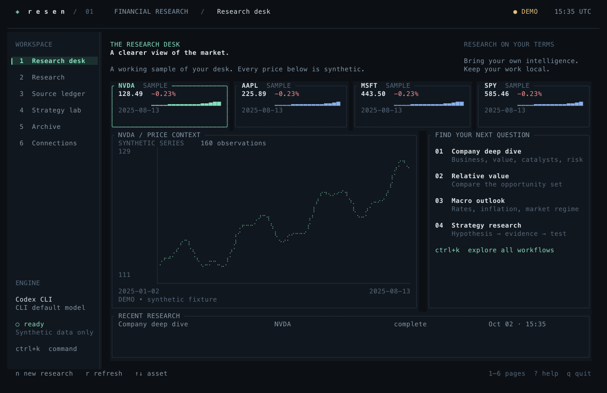
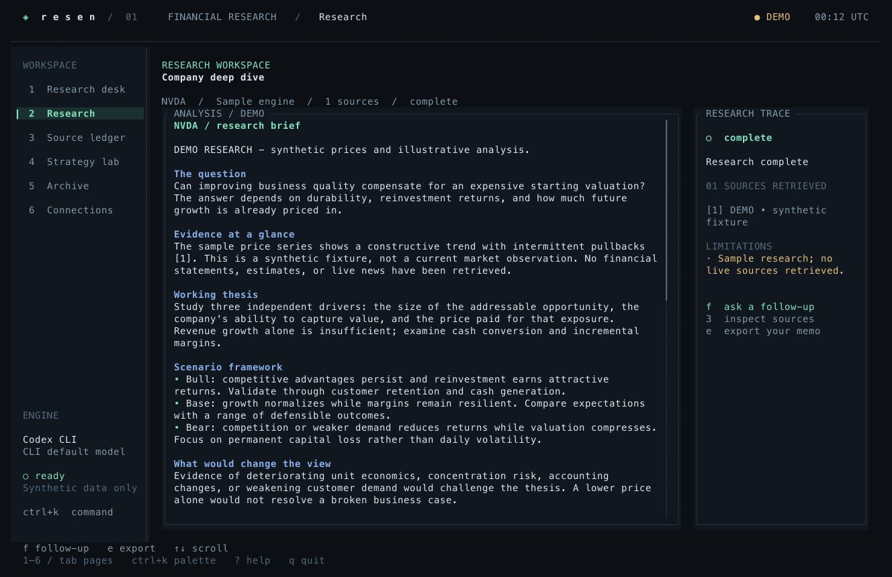
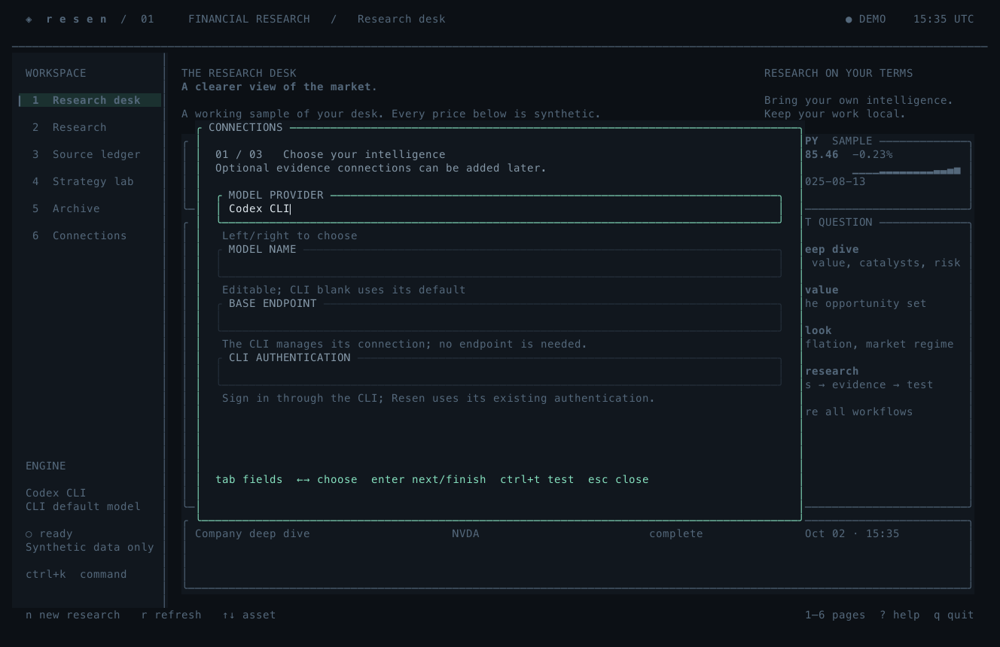
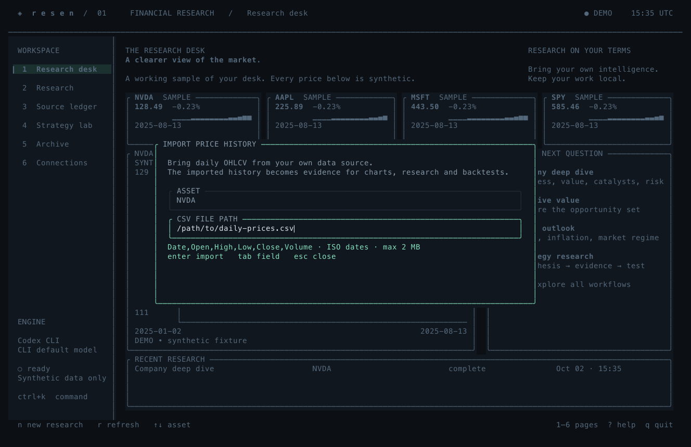

<div align="center">

# resen

### A clearer view of the market.

Your model. Your evidence. Your research desk.<br>
A native financial workspace, built for the terminal.

[](Cargo.toml)
[](docs/UI_RESEARCH.md)
[](LICENSE)

[Get started](#get-started) · [Models](#setup-and-models) · [Data sources](#evidence-connections) · [Strategy lab](#lean-and-quantconnect) · [CLI](#headless-use)

</div>



<p align="center"><sub>The real terminal interface, rendered from the app. All screenshots show labeled, synthetic demo data.</sub></p>

Resen brings financial research into one quiet, keyboard-driven workspace.
Connect a model, gather evidence, ask a question, and keep a source-linked memo
beside your charts. Research, connections, historical studies and the archive
share one native Rust executable. No application server is required.

| | In your workspace |
| :--- | :--- |
| **Research desk** | Daily price charts, a watchlist and a timestamped source ledger. |
| **Your intelligence** | Codex, Claude Code, Ollama, OpenAI, Anthropic or a compatible endpoint. |
| **Evidence-led memos** | Five research workflows, fresh-evidence follow-ups, Markdown and JSON exports. |
| **Strategy lab** | A transparent SMA study, Python/C# LEAN scaffolds and QuantConnect result access. |
| **Local archive** | SQLite persistence, interrupted-run recovery and searchable history. |
| **Considered controls** | Guided setup, masked key fields, a command palette and cancellable jobs. |

## Get started

Rust 1.89+ and a C compiler are required to build; SQLite is bundled.

```sh
# Clone and install.
git clone https://github.com/desenyon/resen.git
cd resen
cargo install --path . --locked

# Explore the full interface without keys or network access.
resen --demo

# Connect your model and evidence sources.
resen setup
```

Prefer to run directly from the build directory?

```sh
cargo build --release --locked
./target/release/resen --demo
```

Use a truecolor terminal and a readable monospace font. No Nerd Font is required.
144×46 or larger gives the full research desk; 80×24 works in compact mode. The
minimum supported size is 60×18. The terminal controls font size and rendering.

`--demo` is completely offline: synthetic prices, a sample memo, no provider
requests, no model use. Demo badges remain attached to archived runs and exports.
Save Connections to leave demo mode.

## Inside the desk

<table>
<tr>
<td width="50%"><strong>Research</strong><br><sub>A memo, its evidence and the next question.</sub></td>
<td width="50%"><strong>Connections</strong><br><sub>Your model, sources and workspace in one form.</sub></td>
</tr>
<tr>
<td></td>
<td></td>
</tr>
</table>

<details>
<summary><strong>Bring your own market history</strong></summary>

Import daily OHLCV from a local CSV for charts, research and historical studies.
The file stays attached to its evidence record.



</details>

## Setup and models

The first-run wizard covers intelligence, sources, and the workspace. Existing
Codex or Claude executables are suggested automatically when found on PATH.
Optional connections can be skipped and added later. Keys are masked in forms.
Use **Ctrl+T** to test a model connection and **Ctrl+S** to save connections.

| Engine | Setup | Execution |
| --- | --- | --- |
| Codex CLI | Install and sign in to `codex`; select Codex CLI | Noninteractive JSONL, read-only sandbox, execution/search/browser/apps disabled, isolated user config; existing auth retained |
| Claude Code | Install and sign in to `claude`; select Claude Code | Print mode, safe mode, tools and MCP disabled; existing auth retained |
| Ollama | Start Ollama, pull a model, enter its exact name | OpenAI-compatible `/v1/chat/completions` |
| OpenAI | `OPENAI_API_KEY`, model and `https://api.openai.com/v1` | Streaming Chat Completions |
| Anthropic | `ANTHROPIC_API_KEY`, model and `https://api.anthropic.com/v1` | Streaming Messages |
| Compatible endpoint | Base URL including `/v1`, model, optional `RESEN_MODEL_API_KEY` | Streaming Chat Completions, with a nonstreaming JSON fallback |

The model field is editable. CLI providers may leave it blank to use the CLI's
default. Remote endpoints require HTTPS; loopback HTTP is allowed for local
models. Endpoints cannot embed credentials. The compatible adapter supports the
Chat Completions protocol, not every vendor's custom API. Reasoning-only models
that reject `max_tokens` require a compatible gateway or another supported model.

API-provider output caps range from 256 to 16,384 tokens. Research makes one model
invocation after gathering evidence. CLI providers keep their own model/output
limits; their invocation has a ten-minute deadline. API generation has a
five-minute request deadline. Configure local models with enough context for the
selected source ledger; Resen does not override the server's context window.
Follow-ups include up to 12,000 characters of the prior memo as context.
No generation occurs on startup or connection check.
CLI connection checks inspect the version and existing authentication without
generating text.

## Evidence connections

| Service | Credential | Use |
| --- | --- | --- |
| Stooq | `STOOQ_API_KEY` | Daily OHLCV; download access requires a vendor key |
| Imported CSV | Local file | Daily history with file provenance; no vendor or network required |
| Alpha Vantage | `ALPHAVANTAGE_API_KEY` | Daily unadjusted history and company overview/ratios |
| Brave Search | `BRAVE_API_KEY` | Search result excerpts with origin URLs |
| Tavily | `TAVILY_API_KEY` | Alternative search excerpts |
| FRED | `FRED_API_KEY` | Latest rates, CPI, unemployment and Treasury observations |
| SEC EDGAR | Contact email in setup | Filing index and selected US-GAAP/IFRS financial facts with units, periods and filing dates |
| QuantConnect | User ID + `QUANTCONNECT_API_TOKEN` + project ID | Authenticated cloud backtest list/full-result access |

Credentials are read from the environment first, then `credentials.json` in the
state directory. On Unix, the directory is mode 0700 and saved credential/config
files are mode 0600. The credential file is **not encrypted**; use environment variables if you
prefer not to persist keys. Ctrl+D in a secret field removes the locally stored
key; it cannot remove a credential inherited from the environment. There is no
telemetry or application server. Selected research evidence is sent to your model
provider, and your research query is sent to the selected search provider.

Quotes are end-of-day observations, never real-time quotes. The price endpoints
do not supply currency, so the UI displays no assumed currency. Search snippets
are not full articles; SEC indexes and selected XBRL facts are not full filings.
SEC observations preserve overlapping reporting periods and restatement dates;
the agent is instructed not to sum annual, quarterly and year-to-date records.
FRED observations use the current vintage. Every memo retains source timestamps,
limitations and its provider/model. Numbered citations are checked against the ledger; existence of
a citation does not prove that a model's interpretation is correct.

Up to six assets can be researched together. Data/search requests are bounded but
consume the connected services' quotas. Failures remain visible; live research
never silently substitutes demo data. If no evidence succeeds, no model call is
made. Missing hosted-model credentials are checked before evidence collection.

## Research workflows

Company deep dives, relative value comparisons, macro outlooks, strategy research,
and custom questions share a source-led workflow: collect evidence, search context,
then synthesize a memo. Follow-ups inherit the prior memo as untrusted context
and retrieve fresh evidence. Reports and partial work are stored in SQLite.
Interrupted runs are recovered on the next launch. One process owns each state
directory; use `--data-dir` for independent desks.

The app does not place orders or execute generated strategy code automatically.
Native provider adapters synthesize from the supplied source ledger. CLI adapters
disable their general execution/customization paths; they are model harnesses,
not autonomous access to your development workspace.

## Keyboard

| Key | Action |
| --- | --- |
| 1–6 / Tab | Navigate pages |
| Ctrl+K / `:` | Search command palette |
| `n` | New research |
| Tab / Shift+Tab | Navigate form fields |
| Ctrl+R | Submit research; Ctrl+Enter is also supported where the terminal reports it |
| Enter in question | Add a line |
| `r` on desk | Refresh daily history |
| ↑↓ / `j` / `k` | Select assets, sources or runs; scroll reports |
| PgUp / PgDn / Home / End | Navigate long reports |
| `f` on research | Follow up |
| `e` on research/sources | Export Markdown and JSON |
| `/` in archive | Filter runs |
| Enter / `s` in connections | Edit connections |
| `t` in connections | Test model |
| `b` in lab | Set parameters and run a historical study |
| ←→ in lab | Switch historical / LEAN / cloud tabs |
| `p` / `l` / `c` in lab | Create Python / run reviewed LEAN / read cloud results |
| Ctrl+C | Cancel the active job; otherwise quit |
| `?` / Esc / `q` | Help / close dialog / quit and save partial work |

## LEAN and QuantConnect

Install the [LEAN CLI](https://www.quantconnect.com/docs/v2/lean-cli/getting-started/installation),
start Docker, authenticate, initialize a workspace with `lean init`, and run a
backtest there once to obtain the required engine image and data. Your account,
organization permissions, and data entitlements still apply. Resen does not
install Docker or download paid data automatically.

Set the workspace in Connections. Create a reviewed starting point:

```sh
resen lean-create --language python
resen lean-create --language csharp
resen lean-run ResenTrendPython
```

The runner invokes `lean backtest <project> --output <run-folder> --no-update`,
streams diagnostics, and reads statistics from the resulting JSON files. Projects
must live inside the configured workspace. Execution is explicit and has a
twenty-minute deadline. Cancelling stops the runner; inspect Docker for any
remaining container. Python/C# templates are starting points, not validated
profitable strategies. Default template dates are 2022-01-01 through 2025-01-01.

Cloud access uses QuantConnect's timestamped SHA-256 authentication. It reads
results and does not start paid cloud jobs:

```sh
resen cloud
resen cloud --backtest-id YOUR_BACKTEST_ID
```

The built-in historical study is separate from LEAN. It models an SMA long/cash
signal using prior closes, fills at next opens, fixed costs on each side, and
terminal liquidation. Buy-and-hold uses the same period and cost assumptions.
It permits fractional shares, uses 252-period annualized zero risk-free Sharpe, and excludes dividends,
tax, financing and execution effects beyond the fixed cost. Vendor adjustment
policy can bias OHLC analysis. CAGR is omitted for periods shorter than a quarter.
Use LEAN and point-in-time data for richer validation.

## Headless use

```sh
resen doctor
resen doctor --online
resen research "Assess business durability and risks" --symbols AAPL
resen research "Compare competitive positions" --symbols AAPL,MSFT --kind comparison
resen research "Assess inflation and rates" --symbols "" --kind macro
resen history
resen export RUN_ID --format markdown --output ./memo.md
resen backtest --symbol SPY --fast 20 --slow 60 --cost-bps 10
resen backtest --csv ./prices.csv --symbol SPY
resen import-csv ./prices.csv --symbol SPY
resen snapshot --page desk --width 144 --height 46 --output ./desk.svg
```

CSV input uses `Date,Open,High,Low,Close,Volume` and ISO dates. Data must be positive,
finite and consistent; duplicate dates are rejected. The simulation requires
strict chronological order and sufficient warm-up history.

Import CSV from the command palette or CLI to use your own history in charts,
research evidence and strategy studies. Importing selects the CSV market source;
each watched asset needs its own imported file. Dates must be zero-padded and
cannot be in the future. Stooq's access requirements changed in 2026; obtain a
download key from the vendor or choose Alpha Vantage or CSV in Connections.

## Development and validation

```sh
cargo fmt --check
cargo clippy --all-targets --locked -- -D warnings
cargo test --locked
cargo build --release --locked
python3 scripts/pty_qa.py --binary target/release/resen
python3 scripts/process_qa.py --binary target/release/resen
```

The HTTP contract tests bind loopback ports and need a sandbox that permits that.
They use mock providers, not paid accounts. The PTY test is Unix-only and uses
Python's standard library. CI is configured for macOS, Linux and Windows; release
packaging is defined for tagged versions, and CI includes a RustSec dependency
audit. The archive loads the most recent 200 runs; older stored IDs remain
available to the export command. See [UI research](docs/UI_RESEARCH.md),
[architecture](docs/ARCHITECTURE.md), and [QA evidence](docs/QA.md).

[MIT](LICENSE). Built with [Ratatui](https://ratatui.rs/) and Rust.
