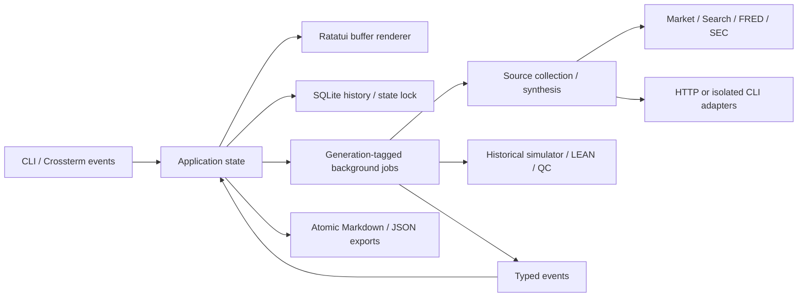

# Architecture

Resen is one process and one native executable. It needs no local web service.

## Ownership

- `domain`: provenance-bearing price/source/run records and symbol validation.
- `config`: validated preferences, environment-first secrets, redaction, private
  state paths and atomic writes.
- `store`: transactional schema migrations, paginated archive queries, record diagnostics,
  exclusive process lock and full interrupted-run recovery.
- `jobs`: shared worker supervision and time/size-based dirty checkpoint policy.
- `data`: bounded HTTP responses, data parsing and provider normalization.
- `provider`: API authentication, stream framing and model CLI protocols.
- `research`: bounded evidence collection, synthesis and citation-ID checks.
- `backtest`: financial calculations, reviewed LEAN execution and QC cloud reads.
- `process`: abort-on-drop ownership of helper tasks attached to child processes.
- `app`: transitions, modal forms, selected records, jobs and persistence updates.
- `ui`: terminal rendering, responsive layout and SVG export of the actual buffer.
- `main`: commands, the terminal lifecycle, signals and async event loop.

## Jobs and persistence

The UI owns foreground state. Background operations receive cloned configuration
and emit typed messages. Every message is stamped with a job generation; messages
from cancelled jobs cannot mutate a subsequent run. Only one external job runs
at a time. A SQLite-backed research record is created before research begins;
sources, partial text and final outcomes are checkpointed. Sources and warnings
flush immediately; text flushes after one second or 64 KiB, independent of UI
ticks. Both event loops run periodic maintenance while a stream is silent.
Cancellation aborts the worker, drains already queued events, persists the final
partial state, and invalidates its generation. A completion already in the queue
wins over cancellation. Late messages cannot mutate a terminal record.

Every asynchronous desk job uses the same supervisor and start/retire helpers.
The supervisor emits a trailing stop event; normal terminal events invalidate its
generation, while an unexpected return or panic becomes a visible job failure.
Research retains a failed partial record in that case. Panic payloads are not
persisted in the archive. In the TUI, only a foreground panic tears down terminal
state; supervised worker failures surface through events. Cancelled handles are
awaited during shutdown and unfinished tasks are aborted on application drop.

Dirty state is cleared only after a successful SQLite write. A failed final save
retains the final record in memory and blocks replacement until maintenance or
cleanup can persist it. CLI persistence errors remain nonzero exits. No disk
failure can guarantee the durability of unsaved text. An OS file lock prevents a
second instance from mistaking a live job for an interrupted one.

No worker draws to the terminal. The event loop redraws on input and a 125 ms
timer. Raw mode, mouse capture, bracketed paste and alternate-screen state are
restored on quit, errors, SIGTERM and panics. SIGKILL cannot be handled by any app;
restart recovers persisted partial runs. The TUI maintenance interval is 125 ms;
headless research uses 250 ms. These timer intervals are scheduling targets and do
not override a blocked filesystem or stalled process.

## Archive schema and queries

Schema 2 retains the original `runs(id, created_at, body)` table and adds `status`,
`search_text` and nullable `read_error`. The JSON body is authoritative; metadata
is derived from it. Ordering and status/ordering indexes support archive access.
Search uses bound parameters and a literal substring of Unicode-lowercased
metadata (ID, question, symbols, workflow label, provider, model, status). Report
bodies are deliberately outside search. Creation timestamps in the index use
fixed-precision UTC; ties break by descending ID.

Opening schema 0/1 performs DDL and metadata backfill in one transaction, updating
`user_version` only on success. Unknown newer versions fail before migration.
Completed JSON bodies are preserved byte for byte. Startup recovery is a separate
atomic pass over every record, in primary-key order with one decoded record in
memory at a time. It validates identity, refreshes derived metadata, clears
resolved diagnostics and changes only abandoned `running` records to
`interrupted`. A database write failure rolls back the whole recovery pass.

Unreadable JSON and mismatched JSON IDs retain their original body and receive a
`read_error`; they cannot poison valid history or overwrite another run during
recovery. Ordinary queries exclude them and expose the archive-wide unreadable
count. If corruption is discovered while reading a page, the page is refilled
with healthy matches. Explicit `get`/export still reports an error for that ID.
`history --issues` exposes IDs and diagnostics, not raw bodies. A manually repaired
body is validated again at the next startup. Physical SQLite corruption remains
a storage error, not a skippable record error.

The TUI keeps a page of 100 full runs in memory. CLI history defaults to 200, with
limits of 1–1000, an offset and an optional exact status. `Store::list` retains its
200-record convenience behavior for compatibility; `Store::query` is the full
query API. Search and recovery have no 200-run horizon. Pagination is ordered but
is not a stable snapshot across commands if new records are inserted. Startup
integrity checking scales with archive size; metadata substring search is not an
FTS index. There is no automatic deletion, backup, downgrade or job resumption.

## Research boundaries

Each live run has at most six symbols and one model invocation. Sources are
structured data with IDs, publishers, URLs, retrieval timestamps and optional
observation dates. Unavailable sources become limitations. No successful source
means no model call. Hosted-model credentials are validated before source calls.

The model receives the source ledger and prior memo as untrusted data. It does
not receive the credential file. API adapters have no code execution tools. CLI
adapters use restricted synthesis commands; they do not run in the repository.
The source ledger is retained independently of the generated narrative. Citation
validation detects missing IDs, not whether a claim is semantically supported.

## External operations

Requests have connection and overall deadlines and bounded response bodies. SSE
framing preserves UTF-8 split across packets and requires an explicit completion
event. Credential redaction retains possible secret prefixes across chunks. No
request is automatically retried into a second paid model invocation.

Child processes receive prompts through stdin. Their arguments do not contain
API credentials. Stderr is drained concurrently, with bounded retained
diagnostics; readers are cancelled with the owning task.
CLI lines are bounded before allocation; LEAN diagnostic forwarding is capped at
8 MB per stream while remaining output is drained.
LEAN receives a reviewed project path as an argument, never through shell
interpolation. Docker is an external lifecycle: users should inspect containers
after cancelling a run.

## Data limitations

Stooq downloads require a vendor key; availability and access conditions may
change. Alpha Vantage is an alternative, and imported CSV history provides an
offline path with its original file recorded as provenance. Neither daily
endpoint supplies a live quote. Currency and adjustment policy must not be
inferred beyond the recorded provider label. FRED evidence includes units,
frequency and seasonal adjustment; current-vintage data cannot establish a
historical point-in-time study. SEC evidence separates the filing index from
selected US-GAAP/IFRS financial observations. Units, duration boundaries, filing
dates, accession numbers and amendments are retained; overlapping periods must
not be summed. Full filings are not read. SEC requests are paced at eight per
second within one desk, below the [published ceiling](https://www.sec.gov/about/developer-resources).

The historical simulator is long/cash with fractional shares and fixed basis
point fees. It excludes dividends, taxes and realistic market impact. LEAN is the
separate event-driven engine for more realistic execution and strategy research.
