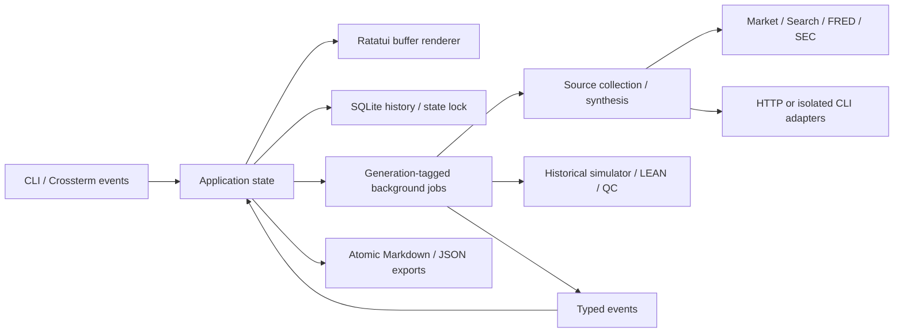

# Architecture

Resen is one process and one native executable. It needs no local web service.

## Ownership

- `domain`: provenance-bearing price/source/run records and symbol validation.
- `config`: validated preferences, environment-first secrets, redaction, private
  state paths and atomic writes.
- `store`: SQLite persistence, exclusive process lock and interrupted-run recovery.
- `data`: bounded HTTP responses, data parsing and provider normalization.
- `provider`: API authentication, stream framing and model CLI protocols.
- `research`: bounded evidence collection, synthesis and citation-ID checks.
- `backtest`: financial calculations, reviewed LEAN execution and QC cloud reads.
- `process`: abort-on-drop ownership of helper tasks attached to child processes.
- `app`: transitions, modal forms, selected records, jobs and persistence updates.
- `ui`: terminal rendering, responsive layout and SVG export of the actual buffer.
- `main`: commands, the terminal lifecycle, signals and async event loop.

## Jobs and persistence

The UI owns foreground state. Background operations receive cloned configuration
and emit typed messages. Every message is stamped with a job generation; messages
from cancelled jobs cannot mutate a subsequent run. Only one external job runs
at a time. A SQLite-backed research record is created before research begins;
sources, partial text and final outcomes are checkpointed. Cancellation keeps
partial evidence and analysis. An OS file lock prevents a second instance from
mistaking a live job for an interrupted one.

No worker draws to the terminal. The event loop redraws on input and a 125 ms
timer. Raw mode, mouse capture, bracketed paste and alternate-screen state are
restored on quit, errors, SIGTERM and panics. SIGKILL cannot be handled by any app;
restart recovers persisted partial runs.

## Research boundaries

Each live run has at most six symbols and one model invocation. Sources are
structured data with IDs, publishers, URLs, retrieval timestamps and optional
observation dates. Unavailable sources become limitations. No successful source
means no model call. Hosted-model credentials are validated before source calls.

The model receives the source ledger and prior memo as untrusted data. It does
not receive the credential file. API adapters have no code execution tools. CLI
adapters use restricted synthesis commands; they do not run in the repository.
The source ledger is retained independently of the generated narrative. Citation
validation detects missing IDs, not whether a claim is semantically supported.

## External operations

Requests have connection and overall deadlines and bounded response bodies. SSE
framing preserves UTF-8 split across packets and requires an explicit completion
event. Credential redaction retains possible secret prefixes across chunks. No
request is automatically retried into a second paid model invocation.

Child processes receive prompts through stdin. Their arguments do not contain
API credentials. Stderr is drained concurrently, with bounded retained
diagnostics; readers are cancelled with the owning task.
CLI lines are bounded before allocation; LEAN diagnostic forwarding is capped at
8 MB per stream while remaining output is drained.
LEAN receives a reviewed project path as an argument, never through shell
interpolation. Docker is an external lifecycle: users should inspect containers
after cancelling a run.

## Data limitations

Stooq downloads require a vendor key; availability and access conditions may
change. Alpha Vantage is an alternative, and imported CSV history provides an
offline path with its original file recorded as provenance. Neither daily
endpoint supplies a live quote. Currency and adjustment policy must not be
inferred beyond the recorded provider label. FRED evidence includes units,
frequency and seasonal adjustment; current-vintage data cannot establish a
historical point-in-time study. SEC evidence separates the filing index from
selected US-GAAP/IFRS financial observations. Units, duration boundaries, filing
dates, accession numbers and amendments are retained; overlapping periods must
not be summed. Full filings are not read. SEC requests are paced at eight per
second within one desk, below the [published ceiling](https://www.sec.gov/about/developer-resources).

The historical simulator is long/cash with fractional shares and fixed basis
point fees. It excludes dividends, taxes and realistic market impact. LEAN is the
separate event-driven engine for more realistic execution and strategy research.
