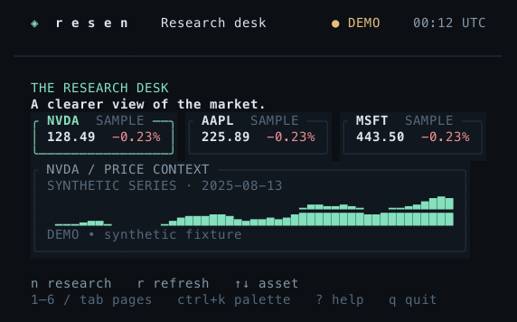
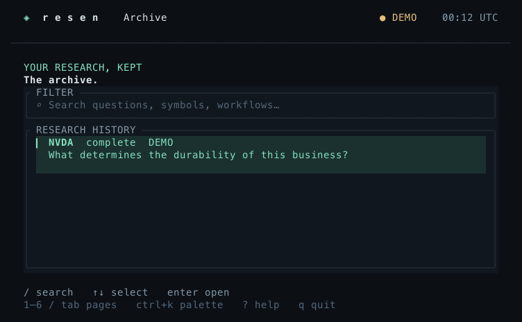
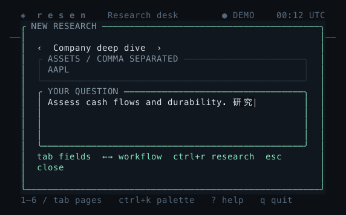
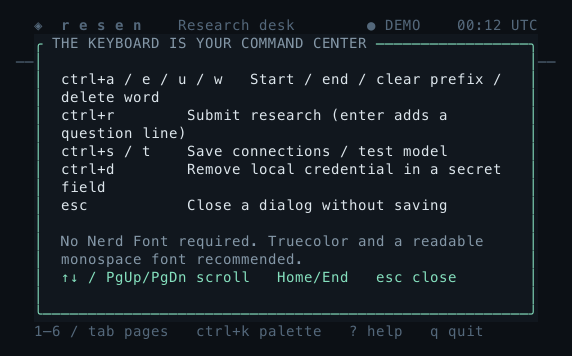

# UI review and upgrade plan

Review date: 3 October 2026. Scope: the existing terminal research desk.

## Evidence and priorities

Reviewed all six pages and welcome, setup, palette and import at 60×18, 80×24
and 144×46 using the executable snapshot command. Reviewed input handling,
form layouts, scrolling and job state against the current UI tests.
Native Terminal access is denied by the computer-use tool; rendered buffers
and actual executable pseudo-terminal checks are the available UI evidence.
Code graph discovery did not respond within several minutes; source reads
were used after attempting the graph tools first.

| Priority | Observed problem | Change | Acceptance |
| --- | --- | --- | --- |
| P0 | Completing setup with a shorter watchlist leaves an invalid asset selection | Reset selection and old market errors on wizard completion | Shorter watchlist saves and desk renders safely |
| P0 | Undersized welcome advertises q but does not accept it | Handle quit before dialog input when below minimum size | q exits and restores terminal even with welcome open |
| P0 | Welcome actions disappear at 60×18; fixed-size forms compete for space | Pin actions and adapt dialog content to height; window strategy fields around focus | Setup/demo, submission and focused fields visible at every supported size |
| P0 | Help clips lower instructions and cannot scroll | Scrollable help with a fixed navigation hint | End reaches form instructions; Home returns to top |
| P0 | Ctrl+W after a multibyte space can panic | Delete words at Unicode character boundaries | Em-space, ideographic space, newline and ASCII word deletion stay valid |
| P1 | Long fields always scroll to their bottom even when editing the start | Scroll input viewport to the cursor | Start, middle and end cursors visible in long, Unicode and multiline values |
| P1 | Paste leaves stale palette/archive selections | Reset selection on changed query; retain palette on zero results | Paste then Enter selects matching result; zero results explain next action |
| P1 | Compact archive columns leave almost no question space | Two-line compact rows with assets/status and the question | Question readable at 60×18 and 80×24; demo provenance explicit |
| P1 | Short screens lose page/context hints and busy cancellation hint | Responsive header/footer, visible job phase | Current page and cancellation visible at supported sizes |
| P1 | Small chart/source/result panels hide observations or provenance | Compact full-range sparkline, selected source row and scrollable study metrics | Synthetic/date labels, source origin and numerical results visible |
| P1 | Error overlay obscures form recovery controls | Esc dismisses errors while preserving the form | Retry retains every value and exposes actions immediately |
| P1 | Help mouse wheel scrolls the page beneath the dialog | Route scroll to help and suppress background form scrolling | Help scroll changes; background stays put |
| P1 | Empty Sources is blank and short headings merge words | Use available panel space and retain logical lines; show a next action | Research, Sources and Lab expose actions at 60×18; no-evidence run explains recovery |
| P2 | Empty archive search looks like a never-used archive | Distinguish no matches and explain how to clear filter | Search failure points to recovery |

## Implementation sequence

1. Repair search/paste and input visibility; add focused regressions.
2. Repair compact dialogs and help navigation; assert actionable content.
3. Improve compact archive, navigation and job status; check wide layouts too.
4. Run formatting, all-target Clippy, all tests, optimized build, PTY QA and
   child-process QA. Render and inspect final compact and wide screens.
5. Commit and push focused changes; verify GitHub CI.

## Follow-up backlog

These require separate product/design work after the current correctness pass:

- Persistent research trace and limitations accessible beside compact memos.
  The Sources page retains evidence; a compact trace view would improve discovery.
- Better connection diagnostics per evidence vendor, beyond model connectivity.
  Live acceptance requires user keys and service entitlements.
- Vertical cursor movement in multiline questions, plus explicit draft/discard UX.
- Reader controls for source and memo search, section jumps and citation navigation.
- Theme/contrast and terminal-font checks on additional real terminal emulators.
- Dedicated cloud/LEAN log ownership and richer progress stages.

Do not label configured integrations as verified; do not fabricate live data,
model outputs or backtest statistics. Keep the existing slate/mint/gold design.

## Verification record

Implemented all findings in the priority table. Four focused functional commits
cover inputs/search, dialogs/help, compact views/recovery, and empty-state/Unicode
actions. A documentation commit refreshes the screenshots and this record. The follow-up backlog remains
separate from the repaired correctness issues.

Fresh local checks on macOS arm64:

- `cargo fmt --check` and all-target Clippy with warnings denied: pass.
- `cargo test --locked`: **81 tests pass**, including **21 new UI regressions**.
- `cargo build --release --locked`: pass.
- Committed executable PTY suite: **24 checks pass**.
- Committed child-process lifecycle suite: **24 checks pass**.
- Ad-hoc actual-executable walkthrough with a PTY and pyte 0.8.2: **34 checks
  pass**, covering setup stages, all six pages, help, Unicode input/cursor moves,
  paste selection, Unicode word deletion, errors/retry, studies, resize, cancellation
  and undersized exit.
- **54 buffers rendered** at 60×18, 80×24 and 144×46. Reviewed representative
  minimum, compact, wide and error layouts; these are real styled cell buffers.

Local runtime records and the ad-hoc walkthrough are retained under ignored
`.qa/ui-audit/`. The reproducible regression coverage is in `tests/ui.rs` and
both committed executable QA scripts. These checks use synthetic fixtures and
isolated temporary configuration, with no paid provider requests.

## Updated compact views

The retained design uses slate panels, mint emphasis and restrained gold status.
Demo provenance stays visible. Short charts sample actual observations across
the full date range; compact studies prioritize metrics and scrollable assumptions.

Real terminal font rendering, contrast and behavior in additional emulators still
need foreground acceptance. Native Terminal access was blocked in this session;
the actual executable was exercised through Unix pseudo-terminals instead.
